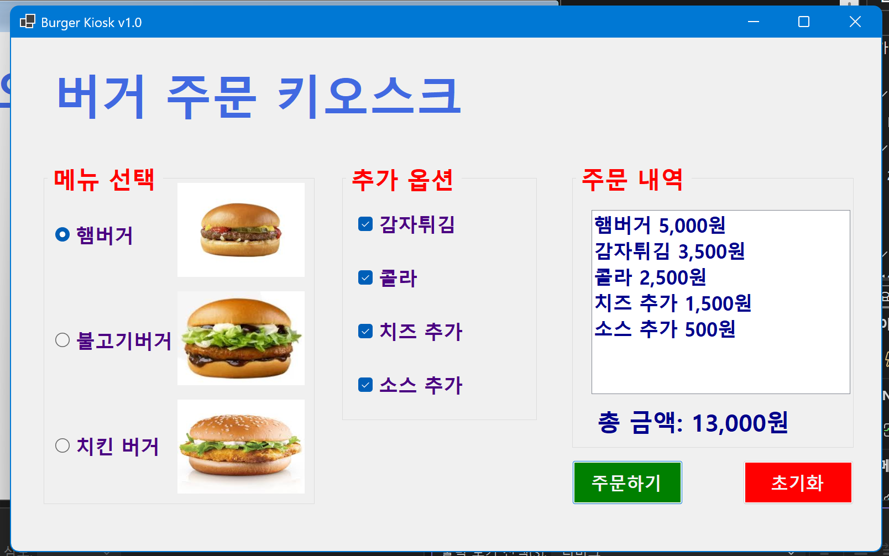
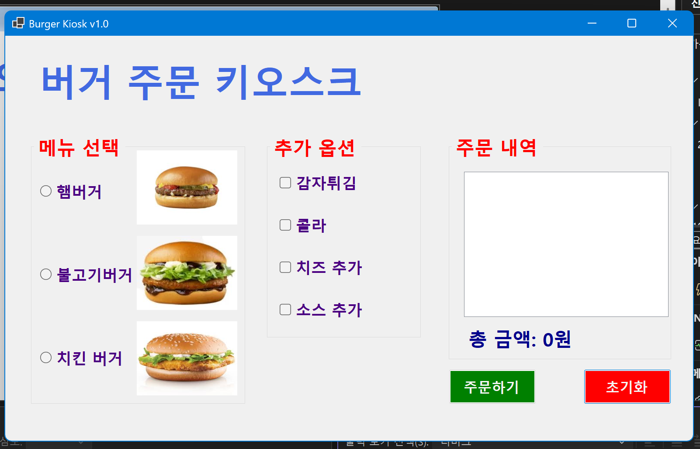
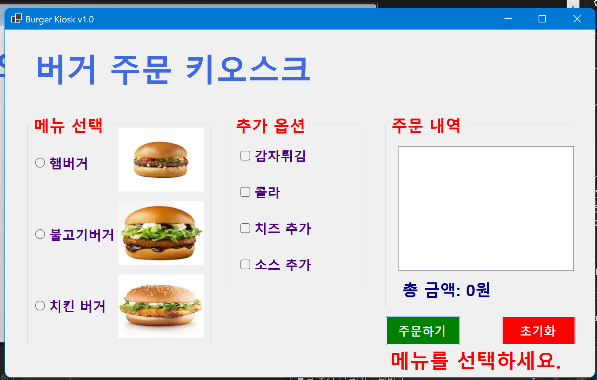
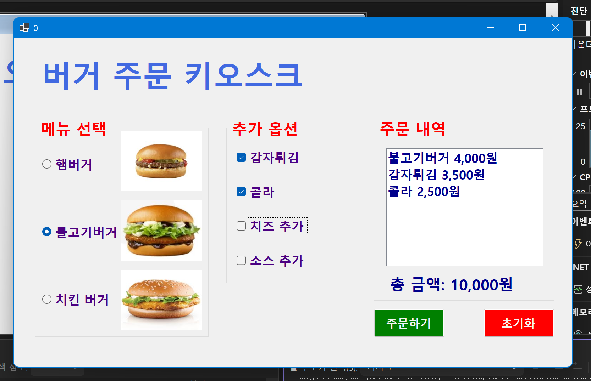
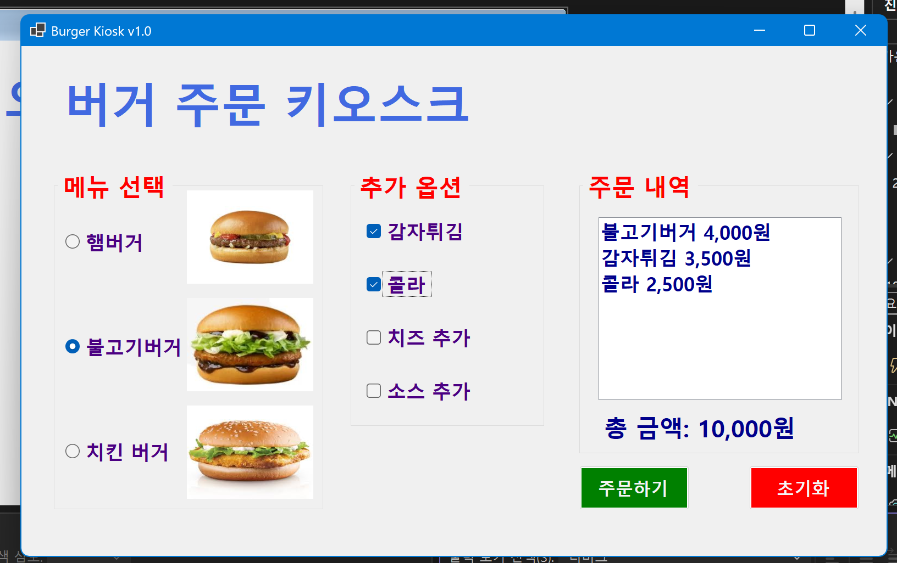

# (C#코딩) 버거 키오스크 주문 프로그램

## 개요
- C# 프로그래밍 학습을 위해 Windows Forms로 구현한 버거 주문 키오스크 프로그램입니다.
- 1줄 소개: 사용자가 메뉴와 추가 옵션을 선택하면 주문 내역과 총 금액을 확인할 수 있는 키오스크 주문 화면입니다.
- 사용한 플랫폼:
- C#, .NET Windows Forms, Visual Studio, GitHub

- 사용한 컨트롤:
- Label
- ListBox
- Button
- GroupBox
- RadioButton
- CheckBox
- PictureBox

- 사용한 기술과 구현한 기능:
- Visual Studio의 Windows Forms 디자이너를 사용하여 키오스크 UI를 구성하였습니다.
- RadioButton을 사용하여 메뉴를 단일 선택할 수 있도록 구현하였습니다.
- CheckBox를 사용하여 추가 옵션을 복수 선택할 수 있도록 구현하였습니다.
- GroupBox를 사용하여 메뉴 영역과 옵션 영역을 구분하고 입력 흐름을 정리하였습니다.
- Checked 속성을 이용하여 사용자가 선택한 메뉴와 옵션을 읽어오도록 구현하였습니다.
- totalCost 변수를 이용하여 선택된 항목의 가격을 누적 계산하도록 구현하였습니다.
- ListBox를 사용하여 현재 주문 내역을 화면에 표시하도록 구현하였습니다.
- Label을 사용하여 총 금액과 안내 메시지를 화면에 출력하도록 구현하였습니다.
- 초기화 버튼을 통해 모든 선택을 해제하고 주문 내역을 처음 상태로 되돌릴 수 있도록 구현하였습니다.
- 에러 메시지를 MessageBox 대신 화면의 Label에 표시하도록 구성하였습니다.
- Tab, 방향키, 스페이스바, Enter 키를 이용하여 키보드만으로도 주문이 가능하도록 구현하였습니다.
- RadioButton과 CheckBox의 선택이 바뀌는 즉시 주문 내역과 총 금액이 실시간으로 갱신되도록 구현하였습니다.

- 핵심 기능:
- 버거 메뉴 단일 선택
- 추가 옵션 복수 선택
- 주문 내역 출력
- 총 금액 자동 계산
- 초기화 기능
- 화면 내 에러 메시지 표시
- 키보드 주문 기능
- 선택 즉시 정보 갱신

- 화면 구성:
- 상단에는 프로그램 제목을 표시하는 Label을 배치하였습니다.
- 왼쪽에는 메뉴 선택용 GroupBox와 RadioButton을 배치하였습니다.
- 가운데에는 추가 옵션 선택용 GroupBox와 CheckBox를 배치하였습니다.
- 오른쪽에는 주문 내역을 보여주는 ListBox를 배치하였습니다.
- 하단에는 총 금액을 표시하는 Label과 주문하기, 초기화 버튼을 배치하였습니다.

## 실행 화면 (과제1)
- 과제1 코드의 실행 스크린샷

- 과제 내용
- RadioButton과 CheckBox를 적절히 배치하여 버거 주문 키오스크의 기본 UI를 구성하였습니다.
- GroupBox를 사용하여 메뉴 선택 영역, 추가 옵션 영역, 주문 내역 영역을 구분하였습니다.
- 주문하기 버튼을 누르면 선택한 메뉴와 옵션이 주문 내역에 표시되도록 구현하였습니다.
- 선택된 항목의 가격을 합산하여 총 금액이 화면에 표시되도록 구현하였습니다.(세자리 수마다 ","가 표시되도록 구현)
- 초기화 버튼을 누르면 모든 선택을 해제하고 주문 내역과 총 금액을 처음 상태로 되돌리도록 구현하였습니다.

- 구현 내용과 기능 설명
- 메뉴 선택은 RadioButton을 사용하여 햄버거, 불고기버거, 치킨버거 중 하나만 선택할 수 있도록 구성하였습니다.
- 추가 옵션은 CheckBox를 사용하여 감자튀김, 콜라, 치즈 추가, 소스 추가를 여러 개 동시에 선택할 수 있도록 구현하였습니다.
- 주문하기 버튼 클릭 시 각 컨트롤의 Checked 상태를 확인하여 선택된 항목만 주문 내역 ListBox에 추가하도록 구현하였습니다.
- 선택된 메뉴와 옵션의 가격을 totalCost 변수에 누적하여 총 금액 Label에 출력하도록 구현하였습니다.
- 초기화 버튼 클릭 시 RadioButton, CheckBox, ListBox, 총 금액 Label을 모두 초기 상태로 되돌리도록 처리하였습니다.
- 버거 주문 키오스크의 기본 동작 흐름인 선택, 계산, 출력, 초기화 과정을 직접 구현할 수 있었습니다.

## 실행 화면 (과제2)
- 과제2 코드의 실행 스크린샷

- 과제 내용
- 아무 메뉴도 선택하지 않고 주문하기 버튼을 눌렀을 때 에러 메시지가 표시되도록 구현하였습니다.
- MessageBox 대신 Label을 사용하여 에러 메시지가 화면에 표시되도록 구성하였습니다.

- 구현 내용과 기능 설명
- 주문하기 버튼 클릭 시 메뉴 선택 여부를 먼저 검사하도록 구현하였습니다.
- 햄버거, 불고기버거, 치킨버거 중 아무 메뉴도 선택되지 않은 경우 주문이 진행되지 않도록 처리하였습니다.
- 에러 발생 시 MessageBox를 띄우는 대신 상태 메시지용 Label에 안내 문구가 표시되도록 구현하였습니다.
- 상태 메시지 Label의 Visible 속성을 이용하여 필요할 때만 메시지가 보이도록 처리하였습니다.
- 메뉴를 정상적으로 선택한 경우에는 에러 메시지가 숨겨지고 주문 내역과 총 금액이 정상적으로 출력되도록 구현하였습니다.
- 사용자에게 덜 방해되는 방식으로 오류를 안내하는 UI를 직접 구현할 수 있었습니다.

## 실행 화면 (과제3)
- 과제3 코드의 실행 스크린샷

- 과제 내용
- 마우스를 사용하지 않고 키보드만으로 주문이 가능하도록 구현하였습니다.
- Tab 키를 이용하여 메뉴 선택 영역, 추가 옵션 영역, 버튼 영역 사이를 이동할 수 있도록 구성하였습니다.
- 방향키를 이용하여 RadioButton 항목 사이를 이동하며 메뉴를 선택할 수 있도록 구현하였습니다.
- 스페이스바를 이용하여 CheckBox 항목을 선택하거나 해제할 수 있도록 구현하였습니다.
- Enter 키를 이용하여 주문하기 버튼과 초기화 버튼을 실행할 수 있도록 구현하였습니다.

- 구현 내용과 기능 설명
- GroupBox를 기준으로 메뉴 선택 영역과 추가 옵션 영역을 구분하여 키보드 포커스 이동이 자연스럽게 이루어지도록 구성하였습니다.
- 각 컨트롤의 TabIndex를 조정하여 Tab 키를 눌렀을 때 메뉴, 옵션, 버튼 순서로 이동하도록 설정하였습니다.
- RadioButton은 같은 GroupBox 안에서 방향키로 항목을 이동하며 선택이 바뀌도록 구성하였습니다.
- CheckBox는 포커스가 있는 상태에서 스페이스바를 눌러 체크 및 해제가 가능하도록 구현하였습니다.
- 주문하기 버튼과 초기화 버튼에는 Enter 키 입력 시 클릭과 같은 동작이 수행되도록 이벤트를 연결하였습니다.
- 키보드만으로 메뉴 선택, 옵션 선택, 주문 실행, 초기화까지 전체 흐름을 사용할 수 있도록 개선하였습니다.

## 실행 화면 (과제4)
- 과제4 코드의 실행 스크린샷

- 과제 내용
- RadioButton과 CheckBox에서 원하는 항목을 선택하는 즉시 주문 내역과 총 금액이 자동으로 갱신되도록 구현하였습니다.
- 메뉴를 선택하면 ListBox에 주문 내역이 바로 표시되고, 추가 옵션을 선택하거나 해제해도 즉시 반영되도록 구성하였습니다.
- 선택 상태에 따라 총 금액 Label이 실시간으로 다시 계산되어 표시되도록 구현하였습니다.

- 구현 내용과 기능 설명
- 메뉴 선택용 RadioButton과 추가 옵션용 CheckBox의 CheckedChanged 이벤트를 이용하여 선택이 바뀌는 순간마다 주문 정보가 갱신되도록 구현하였습니다.
- 주문 내역과 총 금액을 계산하는 공통 메서드를 따로 만들어 메뉴 변경, 옵션 추가, 옵션 해제 상황에서도 같은 로직으로 처리되도록 정리하였습니다.
- ListBox는 선택이 바뀔 때마다 기존 내용을 지우고 현재 선택된 항목만 다시 표시하도록 구현하였습니다.
- 총 금액 Label은 현재 선택된 메뉴와 옵션 가격을 다시 합산하여 즉시 출력되도록 구성하였습니다.
- 메뉴를 선택하지 않은 경우에는 총 금액 대신 안내 문구가 표시되도록 처리하여 사용자에게 현재 상태를 알 수 있게 하였습니다.
- 버튼을 눌러야만 결과가 보이던 방식에서 선택 즉시 반영되는 방식으로 개선하여 키오스크 화면의 사용성을 높일 수 있었습니다.